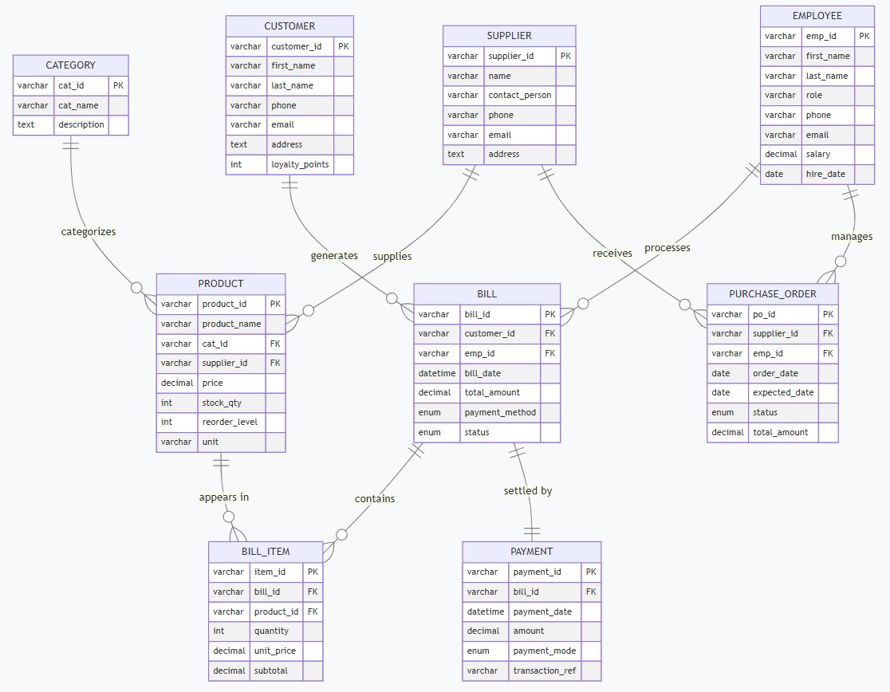

# Reliance Supermarket Management System

A Database Management Systems (DBMS) course project developed using **MySQL** to simulate the operations of a retail supermarket. The project focuses on designing a normalized relational database, implementing it in MySQL, and performing business-oriented SQL queries.

---

## Project Overview

This project demonstrates the complete database development lifecycle:

- Requirement analysis
- Entity Relationship (ER) modeling
- Relational schema design
- Table creation using SQL (DDL)
- Data insertion using SQL (DML)
- Business and analytical SQL queries
- Database documentation

The system models a supermarket by managing products, suppliers, customers, employees, billing, purchase orders, and payments.

---

## Technologies Used

- MySQL 8.0
- MySQL Workbench
- SQL (DDL & DML)
- ER Diagram
- Relational Database Design

---

## Database Design

The database consists of **9 entities**:

- Category
- Supplier
- Product
- Customer
- Employee
- Bill
- Bill_Item
- Purchase_Order
- Payment

The design follows normalization principles and enforces relationships using primary keys, foreign keys, unique constraints, and check constraints.

---
### Entity Relationship Diagram



## Project Structure

```
Reliance-Supermarket-Management-System-DBMS
│
├── SQL
│   ├── 01_schema_definition.sql
│   ├── 02_insert_sample_data.sql
│   ├── 03_business_queries.sql
│   └── 04_maintenance_queries.sql
│
├── Documentation
│   └── DBMS_Project_Report.pdf
│
├── Images
│   └── ER_Diagram.png
│
├── README.md
└── LICENSE
```

---

## SQL Features Demonstrated

- CREATE DATABASE
- CREATE TABLE
- INSERT INTO
- PRIMARY KEY
- FOREIGN KEY
- CHECK Constraints
- UNIQUE Constraints
- INNER JOIN
- LEFT JOIN
- GROUP BY
- HAVING
- ORDER BY
- Aggregate Functions
- Subqueries
- UPDATE
- DELETE

---

## Business Queries

The project includes SQL queries for:

- Inventory monitoring
- Category-wise sales analysis
- Customer purchase analysis
- High-value transaction identification
- Employee sales performance
- Unsold product identification
- Bill generation reports
- Supplier purchase tracking
- Loyalty point updates
- Database maintenance operations

---

## Learning Outcomes

Through this project, I gained practical experience in:

- Designing relational databases
- Building normalized database schemas
- Implementing SQL constraints
- Writing complex SQL queries
- Managing relationships using foreign keys
- Applying database concepts to a real-world retail scenario

---

## Documentation

A detailed project report containing the ER diagram, implementation steps, SQL scripts, and query outputs is available in the **Documentation** folder.

---

## Author

**D. Ravi Theja**

B.Tech Electrical Engineering  
Minor in Computer Science  
National Institute of Technology Warangal

---

*This project was developed as part of the Database Management Systems course.*
